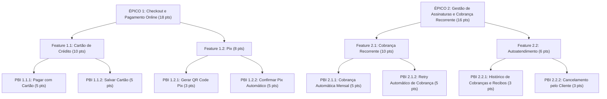

# 🚀 Atividade Prática — Backlog, User Stories, BDD e Planning Poker (iBank)

> **FIAP — Faculdade de Informática e Administração Paulista**  
> **Curso / Disciplina:** Engenharia de Software / Governança & Qualidade Ágil  
> **Entrega:** Atividade Prática de PBIs (até 5 pontos no 4CP)  
> **Estudo de Caso:** Plataforma de Serviços Financeiros **iBank**  

---

## 👥 Integrantes do Grupo

| Nome | RM |
| :--- | :--- |
| **João Vitor Lacerda** | RM **565565** |
| **Murillo Fernandes Carapia** | RM **564969** |
| **Kauan Vieira** | RM **565403** |
| **Pedro de Matos Previtali** | RM **564184** |

---

## 📁 Estrutura do Repositório

```text
├── docs/
│   ├── Atividade_PBI_iBank.docx       # Documento oficial em formato Microsoft Word
│   ├── Atividade_PBI_iBank.pdf        # Documento oficial em formato PDF com paginação e design
│   └── Resolucao_Atividade_PBI.md     # Documento em Markdown com toda a resolução detalhada
├── materiais_contexto/                # Slides e PDFs de apoio das aulas e enunciado
│   ├── Atividade Pbi (até 5pt).pdf
│   ├── Revisao Scrum.pdf
│   ├── Aula 8 - Introducao aos Testes de Software pt2.pdf
│   ├── Aula 5 - Intro Governanca.pdf
│   ├── Aula 6 - Arquitetura de solucao com TOGAF.pdf
│   ├── Aula 7 - Caso – Greenline linhas aereas.pdf
│   ├── Aula 7 - Caso Greenlines - canvas de entendimento.pptx
│   └── Aula4-Expansao da visao sobre a qualidade de software com CMMI e TMMi.pdf
├── .gitignore
└── README.md
```

---

## 📋 Resumo da Estrutura de PBIs & Pontuação



### 📊 Tabela Consolidada de Esforço (Planning Poker - Fibonacci)

| Nível Hierárquico | Identificador & Nome | Pontos (Fibonacci) | Justificativa do Esforço |
| :--- | :--- | :---: | :--- |
| **PBI** | PBI 1.1.1 — Pagar pedido com cartão de crédito | **5** | Integração síncrona com gateway, validações de cartão (Luhn) e tratamento de recusas. |
| **PBI** | PBI 1.1.2 — Salvar cartão para compras futuras | **5** | Tokenização segura PCI-DSS via adquirente, mascaramento de PAN e CRUD de cartões. |
| **FEATURE** | **Feature 1.1: Pagamento via Cartão de Crédito** | **10** | *(Soma: 5 + 5)* |
| **PBI** | PBI 1.2.1 — Gerar QR Code Pix para pagamento | **3** | Chamada à API Pix do PSP para cobrança imediata (cob) e renderização do QR Code/Timer. |
| **PBI** | PBI 1.2.2 — Confirmar Pix automaticamente | **5** | Arquitetura assíncrona orientada a eventos (Webhooks seguros), WebSockets na UI e job de timeout. |
| **FEATURE** | **Feature 1.2: Pagamento via Pix** | **8** | *(Soma: 3 + 5)* |
| 🏆 **ÉPICO** | **ÉPICO 1: Checkout e Pagamento Online** | **18** | *(Soma das Features 1.1 e 1.2: 10 + 8)* |
| **PBI** | PBI 2.1.1 — Cobrar automaticamente o cliente assinante | **5** | Motor de faturamento recorrente em lote (Cron), débito em cartão tokenizado e emails. |
| **PBI** | PBI 2.1.2 — Retry automático de cobrança | **5** | Máquina de estados para régua de Dunning (3 tentativas D+2) e cancelamento por inadimplência. |
| **FEATURE** | **Feature 2.1: Cobrança Recorrente de Assinaturas** | **10** | *(Soma: 5 + 5)* |
| **PBI** | PBI 2.2.1 — Visualizar histórico de cobranças e recibos | **3** | Endpoint de consulta paginada e gerador de recibos em PDF. |
| **PBI** | PBI 2.2.2 — Cancelar assinatura pelo próprio cliente | **3** | Fluxo de cancelamento com questionário de churn e manutenção de acesso diferido até o fim do ciclo. |
| **FEATURE** | **Feature 2.2: Autoatendimento da Assinatura** | **6** | *(Soma: 3 + 3)* |
| 🏆 **ÉPICO** | **ÉPICO 2: Gestão de Assinaturas e Cobrança Recorrente** | **16** | *(Soma das Features 2.1 e 2.2: 10 + 6)* |
| 🎯 **TOTAL** | **TOTAL GERAL DO PROJETO** | **34** | **Soma dos Épicos 1 e 2 (18 + 16 = 34 Story Points)** |

---

## 🛠️ Fundamentos Metodológicos Aplicados

- **Scrum Framework:** Estruturação estrita de Épicos, Features, Histórias de Usuário e Decomposição em Tarefas Técnicas (Tasks de Engenharia).
- **BDD (Behavior-Driven Development) & Gherkin:** Cenários positivos (*caminho feliz*) e negativos (*erros, validações e recusas*) estruturados com `Dado que`, `Quando` e `Então`.
- **Planning Poker:** Estimativa relativa de esforço usando a Sequência de Fibonacci ($1, 2, 3, 5, 8, 13...$), ponderando complexidade algorítmica, incerteza, segurança (PCI-DSS / LGPD) e integrações de microsserviços.
