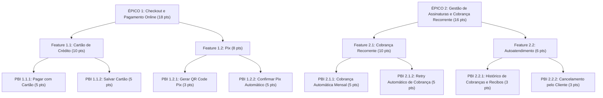

# Resolução da Atividade Prática — Backlog & PBIs (iBank)

---

## 1. Visão Geral da Atividade

- **Contexto de Negócio:** iBank — Instituição financeira/fintech estruturando seus fluxos de pagamentos e modelo de assinaturas recorrentes.
- **Objetivos da Entrega:**
  1. **Reescrita dos PBIs em Histórias de Usuário** no formato canônico:
     - `Como` [ator/papel]
     - `Eu quero` [ação/funcionalidade]
     - `Para` [benefício/valor de negócio]
  2. **Critérios de Aceite em BDD (Gherkin)** com no mínimo 2 cenários por PBI:
     - `[Nome do Cenário]`
     - `Dado que` [contexto/pré-condição]
     - `Quando` [ação realizada]
     - `Então` [resultado esperado]
  3. **Tarefas de Engenharia (Tasks)** com no mínimo 2 tarefas técnicas por PBI para o time de desenvolvimento.
  4. **Estimativa de Esforço com Planning Poker (Escala de Fibonacci: 1, 2, 3, 5, 8, 13, 21...)** com justificativa técnica detalhada (complexidade, incerteza, segurança e integrações).
  5. **Cálculo Consolidado dos Pontos de Esforço** para cada Feature e Épico (seguindo a regra: PBI $\rightarrow$ Feature $\rightarrow$ Épico).

---

## 2. Estrutura e Resolução Completa do Backlog

---

# ÉPICO 1: Checkout e Pagamento Online

> **Descrição do Épico:** Permitir que clientes finalizem compras na loja online realizando pagamentos de forma rápida, segura e com múltiplas formas de pagamento.  
> **Pontos do Épico:** **18 pontos** *(Soma das Features 1.1 e 1.2)*

---

### Feature 1.1: Pagamento via Cartão de Crédito
> **Descrição da Feature:** Possibilitar que o cliente pague seus pedidos usando cartão de crédito diretamente no checkout, incluindo validação dos dados do cartão e tratamento de recusas.  
> **Pontos da Feature:** **10 pontos** *(PBI 1.1.1 + PBI 1.1.2)*

---

#### PBI 1.1.1 — Pagar pedido com cartão de crédito
* **Descrição Original do PO:**  
  *"Precisamos que o cliente consiga colocar os dados do cartão dele (número, validade, nome e CVV) na tela de pagamento e finalizar a compra. Se o cartão for recusado pela operadora, precisa avisar o cliente e deixar ele tentar de novo com outro cartão. Se der certo, mostra uma confirmação do pedido pra ele."*

1. **História de Usuário (User Story):**
   * **Como** cliente da loja online,
   * **Eu quero** inserir os dados do meu cartão de crédito (número, validade, nome impresso e CVV) e processar o pagamento do pedido,
   * **Para que** eu finalize minha compra de forma ágil e segura, sabendo imediatamente se a transação foi aprovada ou recusada.

2. **Critérios de Aceite em BDD (Gherkin):**
   * **Cenário 1: Pagamento com cartão de crédito aprovado com sucesso**
     * **Dado que** estou na tela de checkout com itens no carrinho e selecionei a opção "Cartão de Crédito"
     * **Quando** preencho os dados válidos do cartão (número, nome, validade e CVV) e clico em "Finalizar Compra"
     * **Então** a operadora processa a transação com sucesso, o status do pedido é alterado para "Aprovado" e vejo a tela de confirmação do pedido com o número da compra.

   * **Cenário 2: Pagamento recusado pela operadora do cartão**
     * **Dado que** estou na tela de checkout e informei dados de um cartão que foi recusado pela operadora/banco emissor
     * **Quando** clico em "Finalizar Compra"
     * **Então** vejo uma mensagem de erro clara informando o motivo da recusa e permaneço na tela de pagamento para tentar novamente ou selecionar outro cartão.

3. **Tarefas de Engenharia (Tasks):**
   * **Task 1 (Frontend):** Desenvolver o formulário de pagamento com máscaras de entrada (número, data de validade MM/AA, CVV), validação de algoritmo de Luhn no client-side e feedback visual de carregamento durante a autorização.
   * **Task 2 (Backend):** Implementar endpoint seguro de checkout integrado à API do Gateway de Pagamento, com validação de payload, idempotência de transação e mapeamento de códigos de retorno da adquirente (sucesso, saldo insuficiente, cartão bloqueado, etc.).

4. **Estimativa e Justificativa de Esforço:**
   * **Pontos Estimados:** **5 pontos**
   * **Motivo do Esforço:** Envolve integração externa síncrona com adquirente/gateway de pagamento, tratamento robusto de erros e exceções de rede, conformidade com segurança de dados e criação de fluxos de UI tanto para caminhos felizes quanto para retentativas imediatas.

---

#### PBI 1.1.2 — Salvar cartão de crédito para compras futuras
* **Descrição Original do PO:**  
  *"O cliente devia poder marcar uma caixinha tipo 'salvar esse cartão' na hora de pagar, aí da próxima vez que ele for comprar o cartão já aparece salvo e ele não precisa digitar tudo de novo. Precisa mostrar só os últimos 4 números do cartão salvo, óbvio, e ele tem que poder remover o cartão salvo se quiser."*

1. **História de Usuário (User Story):**
   * **Como** cliente autenticado da loja,
   * **Eu quero** salvar os dados do meu cartão de crédito de forma segura durante o checkout e gerenciar meus cartões salvos,
   * **Para que** eu não precise digitar todos os dados em compras futuras e possa excluir cartões salvos quando desejar.

2. **Critérios de Aceite em BDD (Gherkin):**
   * **Cenário 1: Salvar cartão tokenizado durante o checkout e reutilizá-lo**
     * **Dado que** sou um usuário autenticado na tela de pagamento com novos dados de cartão
     * **Quando** marco a opção "Salvar este cartão para compras futuras" e concluo o pedido
     * **Então** o cartão é salvo via token seguro e, na próxima compra, é exibido mascarado (ex: `**** **** **** 1234`) com a bandeira correspondente para seleção com um clique (solicitando apenas confirmação ou CVV).

   * **Cenário 2: Remover cartão de crédito previamente salvo**
     * **Dado que** possuo um ou mais cartões salvos no meu perfil/tela de checkout
     * **Quando** clico na opção "Excluir cartão" e confirmo a ação no modal
     * **Então** o vínculo do token do cartão é revogado/removido da minha conta e ele deixa de ser exibido na lista de formas de pagamento.

3. **Tarefas de Engenharia (Tasks):**
   * **Task 1 (Backend / Segurança):** Implementar integração de tokenização (PCI-DSS compliant via gateway) para armazenamento seguro de tokens, bandeira e últimos 4 dígitos vinculados ao ID do cliente, além de endpoints REST de listagem e deleção lógica/física de cartões salvos.
   * **Task 2 (Frontend):** Desenvolver componente de seleção de cartões salvos no checkout com layout em carrossel/cards, máscara de dados sensíveis e botão de exclusão com diálogo de confirmação.

4. **Estimativa e Justificativa de Esforço:**
   * **Pontos Estimados:** **5 pontos**
   * **Motivo do Esforço:** Exige conformidade estrita com normas de segurança de dados de cartão (PCI-DSS / tokenização no gateway, sem armazenar dados brutos como CVV ou PAN completo), persistência relacional de tokens por usuário e interface de gerenciamento/remoção.

---

### Feature 1.2: Pagamento via Pix
> **Descrição da Feature:** Possibilitar que o cliente pague seus pedidos via Pix no checkout, com confirmação automática do pagamento.  
> **Pontos da Feature:** **8 pontos** *(PBI 1.2.1 + PBI 1.2.2)*

---

#### PBI 1.2.1 — Gerar QR Code Pix para pagamento do pedido
* **Descrição Original do PO:**  
  *"Na tela de pagamento precisa ter a opção de Pix, e quando o cliente escolhe isso a gente gera um QR Code (e também o código copia-e-cola) pra ele pagar pelo banco dele. O QR Code tem que expirar depois de um tempo, tipo 30 minutos, senão fica um problema de segurança."*

1. **História de Usuário (User Story):**
   * **Como** cliente da loja online,
   * **Eu quero** gerar um QR Code Pix dinâmico e uma linha de código "Copia e Cola" ao selecionar a forma de pagamento Pix,
   * **Para que** eu possa pagar o valor exato do meu pedido pelo aplicativo do meu banco com comodidade dentro do prazo de validade de 30 minutos.

2. **Critérios de Aceite em BDD (Gherkin):**
   * **Cenário 1: Geração bem-sucedida de QR Code e código Copia e Cola com timer**
     * **Dado que** selecionei a opção de pagamento "Pix" na tela de finalização
     * **Quando** clico em "Gerar Pix"
     * **Então** o sistema exibe a imagem do QR Code dinâmico, o botão para copiar o código "Pix Copia e Cola" e um contador regressivo indicando 30 minutos restantes de validade.

   * **Cenário 2: Cópia da chave Copia e Cola para a área de transferência**
     * **Dado que** o QR Code Pix foi gerado na tela
     * **Quando** clico no botão "Copiar código Pix"
     * **Então** o código alfanumérico é transferido para a área de transferência do dispositivo e vejo uma notificação de confirmação ("Código copiado com sucesso!").

3. **Tarefas de Engenharia (Tasks):**
   * **Task 1 (Backend):** Implementar integração com API Pix do PSP/Banco Central para criação de cobrança com vencimento imediato (`cob`), gerando o payload Pix, EMV payload e calculando TTL de 30 minutos.
   * **Task 2 (Frontend):** Desenvolver tela de pagamento Pix com renderizador de imagem do QR Code, botão de cópia com API Clipboard do navegador e contador regressivo (timer) de 30 minutos.

4. **Estimativa e Justificativa de Esforço:**
   * **Pontos Estimados:** **3 pontos**
   * **Motivo do Esforço:** Tarefa de complexidade moderada: chamada à API do PSP para gerar payload Pix, renderização do QR Code no frontend e controle de timer no cliente.

---

#### PBI 1.2.2 — Confirmar automaticamente pedido pago via Pix
* **Descrição Original do PO:**  
  *"Assim que o banco confirmar que o Pix caiu, o pedido já tem que mudar pra 'pago' sozinho, sem o cliente precisar clicar em nada, e mostrar uma telinha de sucesso. Se passar do tempo de expiração e o Pix não cair, o pedido tem que ser cancelado automaticamente."*

1. **História de Usuário (User Story):**
   * **Como** cliente que realizou o pagamento via Pix,
   * **Eu quero** que a confirmação do pagamento seja identificada em tempo real e a tela atualize automaticamente para o status "Pago",
   * **Para que** eu tenha certeza imediata de que minha compra foi concluída sem precisar atualizar a página manualmente.

2. **Critérios de Aceite em BDD (Gherkin):**
   * **Cenário 1: Notificação e atualização automática de pagamento em tempo real**
     * **Dado que** estou na tela de pagamento com o QR Code Pix ativo e efetuo o pagamento no app do meu banco
     * **Quando** o webhook do banco notifica o backend do iBank com a liquidação do Pix
     * **Então** a página do checkout transiciona automaticamente para a tela de "Pedido Aprovado com Sucesso" sem intervenção manual do usuário.

   * **Cenário 2: Cancelamento automático por expiração do prazo de 30 minutos**
     * **Dado que** o QR Code Pix foi gerado e o cliente não realizou o pagamento dentro de 30 minutos
     * **Quando** o cronômetro atinge 00:00
     * **Então** o pedido é marcado como "Cancelado por Expiração", o QR Code é invalidado e o cliente recebe a opção de gerar um novo pedido.

3. **Tarefas de Engenharia (Tasks):**
   * **Task 1 (Backend):** Construir endpoint seguro de Webhook com validação de assinatura HMAC/mTLS para receber callbacks do PSP Pix, atualizar o status do pedido no banco de dados e disparar evento via WebSockets / Server-Sent Events (SSE).
   * **Task 2 (Frontend & Worker):** Implementar conexão WebSocket/SSE (ou polling fallback) no frontend para ouvir o evento de confirmação e redirecionar a tela; configurar rotina/job agendado no backend para cancelamento de pedidos com Pix expirado.

4. **Estimativa e Justificativa de Esforço:**
   * **Pontos Estimados:** **5 pontos**
   * **Motivo do Esforço:** Requer arquitetura assíncrona orientada a eventos (Webhooks seguros, mensageria interna, comunicação em tempo real via WebSockets para a UI) e rotinas agendadas para cancelamento por timeout.

---

# ÉPICO 2: Gestão de Assinaturas e Cobrança Recorrente

> **Descrição do Épico:** Permitir que a empresa ofereça planos por assinatura, cobrando os clientes de forma automática e recorrente, com visibilidade e controle para o próprio cliente sobre sua assinatura.  
> **Pontos do Épico:** **16 pontos** *(Soma das Features 2.1 e 2.2)*

---

### Feature 2.1: Cobrança Recorrente de Assinaturas
> **Descrição da Feature:** Cobrar automaticamente o cliente assinante todo mês na data de vencimento do plano, lidando também com casos em que a cobrança falha.  
> **Pontos da Feature:** **10 pontos** *(PBI 2.1.1 + PBI 2.1.2)*

---

#### PBI 2.1.1 — Cobrar automaticamente o cliente assinante
* **Descrição Original do PO:**  
  *"O sistema precisa cobrar o cartão salvo do assinante automaticamente todo mês, na mesma data em que ele assinou o plano. Se a cobrança falhar (cartão vencido, sem limite, etc.), o cliente precisa ser avisado por e-mail e a assinatura fica marcada como 'pagamento pendente' até ele regularizar. Se a cobrança der certo, a assinatura continua ativa normalmente."*

1. **História de Usuário (User Story):**
   * **Como** sistema iBank / gestor de assinaturas,
   * **Eu quero** debitar automaticamente no cartão salvo do cliente o valor da mensalidade na data de vencimento de cada ciclo,
   * **Para que** a assinatura permaneça ativa de forma contínua sem que o cliente precise renovar manualmente todo mês.

2. **Critérios de Aceite em BDD (Gherkin):**
   * **Cenário 1: Cobrança recorrente mensal processada com sucesso**
     * **Dado que** o assinante possui uma assinatura ativa e um cartão de crédito válido vinculado
     * **Quando** o sistema atinge a data do ciclo de faturamento mensal e dispara a cobrança
     * **Então** a transação é autorizada, a vigência do plano é prorrogada por mais 30 dias e a assinatura permanece com status "Ativa".

   * **Cenário 2: Falha no débito recorrente e mudança para pagamento pendente**
     * **Dado que** a data de cobrança mensal foi atingida e o cartão cadastrado foi recusado (sem limite, expirado ou bloqueado)
     * **Quando** o sistema processa a transação e recebe a resposta de falha da adquirente
     * **Então** o status da assinatura é atualizado para "Pagamento Pendente" e um e-mail transacional é enviado ao cliente com alerta e link para atualização do método de pagamento.

3. **Tarefas de Engenharia (Tasks):**
   * **Task 1 (Backend / Batch Engine):** Desenvolver job agendado (Cron/Scheduler) diário com particionamento de lote para identificar assinaturas elegíveis à cobrança do dia, invocar o gateway com cartão tokenizado e atualizar datas de ciclo.
   * **Task 2 (Serviço de Mensageria / E-mail):** Implementar integração com serviço de e-mail transacional (ex: AWS SES/SendGrid) com templates dinâmicos de aviso de cobrança efetuada com sucesso ou falha no pagamento com CTA para regularização.

4. **Estimativa e Justificativa de Esforço:**
   * **Pontos Estimados:** **5 pontos**
   * **Motivo do Esforço:** Exige criação de motor de recorrência confiável (tolerância a falhas, bloqueios pessimistas para evitar duplicidade de cobrança, gerenciamento de ciclo de vida de assinaturas e disparo de e-mails transacionais).

---

#### PBI 2.1.2 — Tentar novamente cobrança que falhou (retry automático)
* **Descrição Original do PO:**  
  *"Quando a cobrança falhar, não pode simplesmente desistir na primeira tentativa. O sistema tem que tentar cobrar de novo automaticamente, tipo 3 vezes, com um intervalo de uns 2 dias entre cada tentativa. Se depois das 3 tentativas ainda falhar, aí sim a assinatura é cancelada e o cliente é avisado."*

1. **História de Usuário (User Story):**
   * **Como** sistema iBank,
   * **Eu quero** executar uma régua de retentativas automáticas de cobrança (até 3 tentativas a cada 2 dias) em faturas não pagas,
   * **Para que** taxas de inadimplência involuntária sejam reduzidas antes de efetivar o cancelamento da assinatura.

2. **Critérios de Aceite em BDD (Gherkin):**
   * **Cenário 1: Sucesso na segunda ou terceira retentativa de cobrança**
     * **Dado que** uma assinatura está com status "Pagamento Pendente" após 1 falha anterior
     * **Quando** o job de retentativa executa no intervalo de 2 dias e o cartão do cliente agora possui limite disponível
     * **Então** o pagamento é aprovado, o contador de retentativas é resetado, o status da assinatura volta para "Ativa" e o cliente é notificado do sucesso.

   * **Cenário 2: Esgotamento das 3 tentativas e cancelamento definitivo da assinatura**
     * **Dado que** a cobrança de uma assinatura falhou em todas as 3 tentativas espaçadas a cada 2 dias
     * **Quando** a terceira tentativa é recusada pelo gateway
     * **Então** o sistema altera o status da assinatura para "Cancelada por Inadimplência", encerra o acesso aos benefícios e envia um e-mail de notificação de cancelamento ao cliente.

3. **Tarefas de Engenharia (Tasks):**
   * **Task 1 (Backend / Dunning Logic):** Implementar tabela/estrutura de histórico de cobranças e controle de régua de cobrança (*Dunning Management*), registrando número da tentativa (1 a 3), data da próxima execução (intervalo D+2) e status de cada tentativa.
   * **Task 2 (Backend / Lifecycle & Notification):** Desenvolver rotina assíncrona de processamento da fila de retentativas e trigger de transição de estado final para cancelamento com envio de e-mail de rescisão.

4. **Estimativa e Justificativa de Esforço:**
   * **Pontos Estimados:** **5 pontos**
   * **Motivo do Esforço:** Envolve gerenciamento de máquina de estados complexa com agendamento temporal distribuído (retentativas com backoff de 2 dias), idempotência e encerramento automatizado de direitos de acesso.

---

### Feature 2.2: Autoatendimento da Assinatura pelo Cliente
> **Descrição da Feature:** Dar autonomia para o cliente visualizar e gerenciar sua própria assinatura sem precisar acionar o suporte.  
> **Pontos da Feature:** **6 pontos** *(PBI 2.2.1 + PBI 2.2.2)*

---

#### PBI 2.2.1 — Visualizar histórico de cobranças da assinatura
* **Descrição Original do PO:**  
  *"O cliente precisa ter uma área tipo 'minha assinatura' onde ele vê todas as cobranças que já rolaram, com data, valor e status (pago, falhou, pendente). Ele também deveria poder baixar um comprovante/recibo de cada cobrança que deu certo."*

1. **História de Usuário (User Story):**
   * **Como** cliente assinante,
   * **Eu quero** acessar o histórico detalhado de cobranças da minha assinatura e realizar o download dos recibos em PDF das faturas pagas,
   * **Para que** eu tenha controle financeiro e comprovantes para minha prestação de contas.

2. **Critérios de Aceite em BDD (Gherkin):**
   * **Cenário 1: Visualização da listagem de histórico com filtros e status**
     * **Dado que** sou um assinante autenticado e acesso a página "Minha Assinatura"
     * **Quando** navego até a seção "Histórico de Cobranças"
     * **Então** visualizo a lista ordenada cronologicamente contendo data de cobrança, valor faturado, método de pagamento utilizado e status (`Pago`, `Pendente`, `Falhou`).

   * **Cenário 2: Download do comprovante/recibo em PDF de fatura paga**
     * **Dado que** visualizo uma cobrança com status "Pago" no meu histórico
     * **Quando** clico no botão "Baixar Recibo"
     * **Então** o sistema gera e inicia o download de um arquivo PDF contendo os dados fiscais, dados do titular, valor e autenticação da transação.

3. **Tarefas de Engenharia (Tasks):**
   * **Task 1 (Backend):** Criar endpoint RESTful paginado `/api/v1/subscriptions/{id}/invoices` e serviço de renderização de PDF (ex: Puppeteer/PDFKit) para emissão de comprovantes de pagamento.
   * **Task 2 (Frontend):** Construir a interface da aba "Minha Assinatura" com tabela responsiva, badges visuais por status e botão de download com feedback de progresso.

4. **Estimativa e Justificativa de Esforço:**
   * **Pontos Estimados:** **3 pontos**
   * **Motivo do Esforço:** Complexidade moderada e bem definida: consulta padrão com paginação e geração de template PDF para download no client-side.

---

#### PBI 2.2.2 — Cancelar assinatura pelo próprio cliente
* **Descrição Original do PO:**  
  *"O cliente tem que poder cancelar a assinatura dele mesmo, sem precisar ligar pra ninguém. Depois que ele cancela, a assinatura continua ativa até o fim do período já pago, e só depois disso é que para de verdade. Precisa também pedir um motivo do cancelamento antes de confirmar."*

1. **História de Usuário (User Story):**
   * **Como** cliente assinante,
   * **Eu quero** solicitar o cancelamento da minha assinatura diretamente pelo portal informando o motivo,
   * **Para que** o cancelamento seja efetuado com transparência e eu continue usufruindo do serviço até o término do período já faturado.

2. **Critérios de Aceite em BDD (Gherkin):**
   * **Cenário 1: Cancelamento com preenchimento obrigatório do motivo e vigência até o fim do ciclo**
     * **Dado que** possuo uma assinatura ativa e clico em "Cancelar Assinatura"
     * **Quando** seleciono um dos motivos no questionário (ou digito uma justificativa) e confirmo a solicitação
     * **Então** o status da assinatura muda para "Cancelamento Agendado", nenhuma nova cobrança é gerada e meu acesso permanece ativo até o último dia do ciclo já pago.

   * **Cenário 2: Tentativa de cancelamento sem selecionar o motivo**
     * **Dado que** abri o modal de cancelamento de assinatura
     * **Quando** tento clicar em "Confirmar Cancelamento" sem selecionar uma opção de motivo
     * **Então** o sistema bloqueia o envio, exibe um alerta de validação ("Por favor, selecione um motivo") e mantém a assinatura ativa.

3. **Tarefas de Engenharia (Tasks):**
   * **Task 1 (Frontend):** Criar modal de cancelamento e retenção com formulário de motivo (select/radio buttons + campo de texto opcional), alertas explicativos sobre a data final de acesso e confirmação em 2 etapas.
   * **Task 2 (Backend):** Implementar endpoint PATCH `/api/v1/subscriptions/{id}/cancel` para gravar o motivo do churn na base analítica, desativar a renovação automática e agendar a inativação do acesso para a data final do ciclo vigente (`expires_at`).

4. **Estimativa e Justificativa de Esforço:**
   * **Pontos Estimados:** **3 pontos**
   * **Motivo do Esforço:** Regra de negócio simples e direta: alteração de flag de renovação, registro de feedback de cancelamento e manutenção da data de expiração contratada.

---

## 3. Resumo Consolidado de Pontuação (Planning Poker)

| Nível Hierárquico | Identificador & Nome | Pontos Estimados (Fibonacci) | Justificativa Sintética |
| :--- | :--- | :---: | :--- |
| **PBI** | PBI 1.1.1 — Pagar pedido com cartão de crédito | **5** | Integração de gateway síncrona, validações de cartão e fluxo de recusa |
| **PBI** | PBI 1.1.2 — Salvar cartão de crédito para compras futuras | **5** | Tokenização segura (PCI-DSS), mascaramento e gestão de tokens |
| **FEATURE** | **Feature 1.1: Pagamento via Cartão de Crédito** | **10** | *(Soma: 5 + 5)* |
| **PBI** | PBI 1.2.1 — Gerar QR Code Pix para pagamento do pedido | **3** | Geração de payload Pix imediato e timer no frontend |
| **PBI** | PBI 1.2.2 — Confirmar automaticamente pedido pago via Pix | **5** | Webhooks seguros, WebSockets em tempo real e rotina de timeout |
| **FEATURE** | **Feature 1.2: Pagamento via Pix** | **8** | *(Soma: 3 + 5)* |
| **ÉPICO** | **ÉPICO 1: Checkout e Pagamento Online** | **18** | *(Soma das Features 1.1 e 1.2: 10 + 8)* |
| **PBI** | PBI 2.1.1 — Cobrar automaticamente o cliente assinante | **5** | Motor de agendamento em lote, débito em cartão salvo e e-mails |
| **PBI** | PBI 2.1.2 — Tentar novamente cobrança que falhou (retry) | **5** | Máquina de estados para régua de Dunning (3 tentativas D+2) |
| **FEATURE** | **Feature 2.1: Cobrança Recorrente de Assinaturas** | **10** | *(Soma: 5 + 5)* |
| **PBI** | PBI 2.2.1 — Visualizar histórico de cobranças da assinatura | **3** | Listagem paginada e gerador de comprovante PDF |
| **PBI** | PBI 2.2.2 — Cancelar assinatura pelo próprio cliente | **3** | Fluxo de pesquisa de churn e cancelamento diferido ao fim do ciclo |
| **FEATURE** | **Feature 2.2: Autoatendimento da Assinatura** | **6** | *(Soma: 3 + 3)* |
| **ÉPICO** | **ÉPICO 2: Gestão de Assinaturas e Cobrança Recorrente** | **16** | *(Soma das Features 2.1 e 2.2: 10 + 6)* |
| **TOTAL DO PROJETO** | **Soma Total de Todos os Épicos** | **34** | **18 + 16 = 34 Story Points** |

---

## 4. Destaques Metodológicos e Alinhamento com o Material de Aula

1. **User Stories (Revisão Scrum):** Focadas estritamente no valor do usuário final e no padrão da indústria (`Como... Eu quero... Para...`).
2. **BDD & Gherkin (Aula 8 - Testes de Software):** Cenários positivos (*caminho feliz*) e negativos (*caminho com erro/recusa/validação*), permitindo automação de testes de aceitação e cobertura de transições de estado.
3. **Tasks de Desenvolvimento (Scrum / Engenharia):** Decomposição técnica clara separando Frontend e Backend/Integrações.
4. **Planning Poker & Fibonacci (Scrum):** Estimativas embasadas em esforço cognitivo, incerteza, segurança (PCI/LGPD) e integrações de microsserviços/APIs externas.
